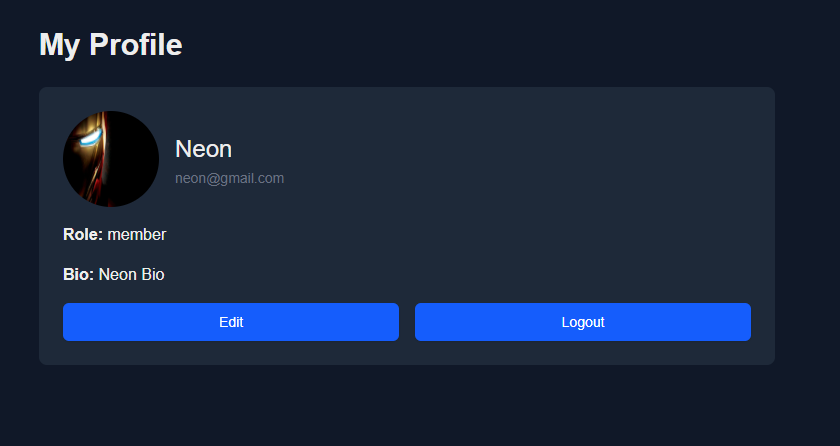

This is a [Next.js](https://nextjs.org) project bootstrapped with [`create-next-app`](https://nextjs.org/docs/app/api-reference/cli/create-next-app).

## INTRO

# Just do IT

A project management tool is all you need.

### Project Description

Our project, JUSTDOIT, is a project management tool made for IT teams and organizations helping them to keep track of their ongoing progress. This app will allow them to create different boards for different project, add their respective tasks and group them by a specific tag. The drag and drop feature make it easier and intuitive for users to manage their boards. The project manager can also assign task to multiple employees holding them accountable for their work.

### Main Features

1. Drag and drop task card between multiple columns
2. Assigning users to a task card
3. Adding tags to the task card
4. Creating custom columns for a board
5. Managing multiple boards created by the person
6. Inviting different users via email to collaborate
7. Data flow and optimization for multiple platforms
8. User roles and permission checking

## Task Distribution
James
* tasks & project dashboard (✅ Completed in Phase 2)
* drag and drop implementation (✅ Completed in Phase 2)
* tasks filtering

Rita
* My projects page
* Project summary page

Ayush
* auth, login and signup flow (✅ Completed in Phase 2)
* and settings
* task comments (✅ Completed in Phase 3)

Ghanshyam
* user profile page (✅ Completed in Phase 2) 
* project settings page (✅ Completed in Phase 3)
* project user/role management

## Phase 2 - Preview

#### Home Page


#### Login


#### Sign up


#### Project page


#### User Setting Page



## Getting Started

First, run the development server:

```bash
npm run dev
# or
yarn dev
# or
pnpm dev
# or
bun dev
```

Open [http://localhost:3000](http://localhost:3000) with your browser to see the result.

You can start editing the page by modifying `app/page.tsx`. The page auto-updates as you edit the file.

This project uses [`next/font`](https://nextjs.org/docs/app/building-your-application/optimizing/fonts) to automatically optimize and load [Geist](https://vercel.com/font), a new font family for Vercel.

## Learn More

To learn more about Next.js, take a look at the following resources:

- [Next.js Documentation](https://nextjs.org/docs) - learn about Next.js features and API.
- [Learn Next.js](https://nextjs.org/learn) - an interactive Next.js tutorial.

You can check out [the Next.js GitHub repository](https://github.com/vercel/next.js) - your feedback and contributions are welcome!

## Deploy on Vercel

The easiest way to deploy your Next.js app is to use the [Vercel Platform](https://vercel.com/new?utm_medium=default-template&filter=next.js&utm_source=create-next-app&utm_campaign=create-next-app-readme) from the creators of Next.js.

Check out our [Next.js deployment documentation](https://nextjs.org/docs/app/building-your-application/deploying) for more details.
